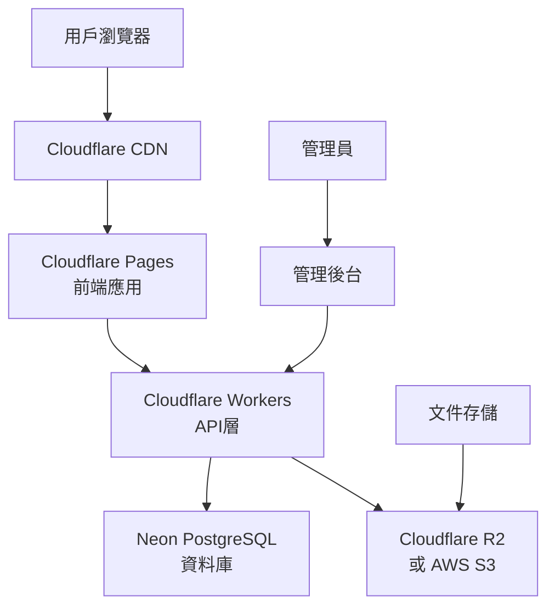

# 藥助Next學院網站設計文檔

## 概述

藥助Next學院是一個現代化的線上教育與就業媒合平台，專門為藥局助理轉職提供服務。本設計採用現代化的前端框架配合雲端服務，確保高效能、可擴展性和優秀的用戶體驗。

## 技術架構

### 技術棧選擇

**前端技術：**
- **框架：** Vue 3 (Composition API) 或 React 18
- **構建工具：** Vite
- **CSS框架：** Bulma 0.9+
- **狀態管理：** Pinia (Vue) 或 Zustand (React)
- **路由：** Vue Router 4 或 React Router 6
- **HTTP客戶端：** Axios

**後端與資料庫：**
- **資料庫：** Neon PostgreSQL (雲端)
- **API：** RESTful API 或 GraphQL
- **認證：** JWT Token

**部署與託管：**
- **前端部署：** Cloudflare Pages
- **API部署：** Cloudflare Workers 或 Vercel Functions
- **CDN：** Cloudflare CDN
- **域名與DNS：** Cloudflare

### 架構圖



## 系統架構

### 前端架構

**組件結構：**
```
src/
├── components/           # 可重用組件
│   ├── common/          # 通用組件
│   ├── forms/           # 表單組件
│   ├── layout/          # 佈局組件
│   └── ui/              # UI組件
├── views/               # 頁面組件
│   ├── auth/            # 認證相關頁面
│   ├── courses/         # 課程相關頁面
│   ├── jobs/            # 就業媒合頁面
│   ├── profile/         # 用戶資料頁面
│   └── admin/           # 管理後台頁面
├── stores/              # 狀態管理
├── services/            # API服務
├── utils/               # 工具函數
├── assets/              # 靜態資源
└── styles/              # 樣式文件
```

**響應式設計：**
- 使用 Bulma 的響應式網格系統
- 支援桌面、平板、手機三種設備
- 採用 Mobile-First 設計原則

### 後端架構

**API設計：**
```
/api/v1/
├── auth/                # 認證相關
│   ├── POST /login
│   ├── POST /register
│   ├── POST /logout
│   └── GET /profile
├── courses/             # 課程管理
│   ├── GET /courses
│   ├── GET /courses/:id
│   ├── POST /courses/:id/enroll
│   └── GET /courses/:id/progress
├── jobs/                # 就業媒合
│   ├── GET /jobs
│   ├── POST /jobs
│   ├── GET /jobs/:id
│   └── POST /jobs/:id/apply
├── users/               # 用戶管理
│   ├── GET /users/profile
│   ├── PUT /users/profile
│   └── GET /users/dashboard
├── files/               # 文件管理
│   ├── GET /files
│   ├── GET /files/:id/download
│   └── POST /files/upload
└── admin/               # 管理功能
    ├── GET /admin/stats
    ├── GET /admin/users
    └── GET /admin/reports
```

## 資料模型

### 資料庫設計

**用戶表 (users):**
```sql
CREATE TABLE users (
    id SERIAL PRIMARY KEY,
    email VARCHAR(255) UNIQUE NOT NULL,
    password_hash VARCHAR(255) NOT NULL,
    user_type VARCHAR(20) NOT NULL CHECK (user_type IN ('job_seeker', 'employer')),
    first_name VARCHAR(100) NOT NULL,
    last_name VARCHAR(100) NOT NULL,
    phone VARCHAR(20),
    created_at TIMESTAMP DEFAULT CURRENT_TIMESTAMP,
    updated_at TIMESTAMP DEFAULT CURRENT_TIMESTAMP,
    is_active BOOLEAN DEFAULT true
);
```

**課程表 (courses):**
```sql
CREATE TABLE courses (
    id SERIAL PRIMARY KEY,
    title VARCHAR(255) NOT NULL,
    description TEXT,
    course_type VARCHAR(50) NOT NULL CHECK (course_type IN ('basic', 'advanced', 'internship')),
    duration_hours INTEGER,
    price DECIMAL(10,2),
    instructor_id INTEGER REFERENCES users(id),
    is_active BOOLEAN DEFAULT true,
    created_at TIMESTAMP DEFAULT CURRENT_TIMESTAMP,
    updated_at TIMESTAMP DEFAULT CURRENT_TIMESTAMP
);
```

**課程註冊表 (course_enrollments):**
```sql
CREATE TABLE course_enrollments (
    id SERIAL PRIMARY KEY,
    user_id INTEGER REFERENCES users(id),
    course_id INTEGER REFERENCES courses(id),
    enrollment_date TIMESTAMP DEFAULT CURRENT_TIMESTAMP,
    completion_date TIMESTAMP,
    progress_percentage INTEGER DEFAULT 0,
    final_score INTEGER,
    status VARCHAR(20) DEFAULT 'enrolled' CHECK (status IN ('enrolled', 'in_progress', 'completed', 'dropped'))
);
```

**職缺表 (jobs):**
```sql
CREATE TABLE jobs (
    id SERIAL PRIMARY KEY,
    employer_id INTEGER REFERENCES users(id),
    title VARCHAR(255) NOT NULL,
    description TEXT,
    location VARCHAR(255),
    salary_min DECIMAL(10,2),
    salary_max DECIMAL(10,2),
    job_type VARCHAR(50) CHECK (job_type IN ('full_time', 'part_time', 'internship')),
    requirements TEXT,
    is_active BOOLEAN DEFAULT true,
    created_at TIMESTAMP DEFAULT CURRENT_TIMESTAMP,
    expires_at TIMESTAMP
);
```

**求職申請表 (job_applications):**
```sql
CREATE TABLE job_applications (
    id SERIAL PRIMARY KEY,
    job_id INTEGER REFERENCES jobs(id),
    applicant_id INTEGER REFERENCES users(id),
    application_date TIMESTAMP DEFAULT CURRENT_TIMESTAMP,
    status VARCHAR(20) DEFAULT 'pending' CHECK (status IN ('pending', 'reviewed', 'accepted', 'rejected')),
    cover_letter TEXT,
    resume_url VARCHAR(500)
);
```

**文件表 (documents):**
```sql
CREATE TABLE documents (
    id SERIAL PRIMARY KEY,
    title VARCHAR(255) NOT NULL,
    description TEXT,
    file_url VARCHAR(500) NOT NULL,
    file_type VARCHAR(50),
    file_size INTEGER,
    category VARCHAR(100),
    is_public BOOLEAN DEFAULT true,
    uploaded_by INTEGER REFERENCES users(id),
    created_at TIMESTAMP DEFAULT CURRENT_TIMESTAMP
);
```

## 組件與介面設計

### 主要頁面組件

**1. 首頁 (HomePage.vue/jsx)**
- 展示訓練核心政策
- 課程介紹輪播
- 成功案例展示
- 快速註冊入口

**2. 用戶認證 (AuthPages)**
- 登入頁面 (LoginPage)
- 註冊頁面 (RegisterPage) - 包含求職者/雇主選擇
- 忘記密碼頁面 (ForgotPasswordPage)

**3. 課程系統 (CoursePages)**
- 課程列表頁面 (CourseListPage)
- 課程詳情頁面 (CourseDetailPage)
- 學習進度頁面 (ProgressPage)
- 測驗頁面 (QuizPage)

**4. 就業媒合 (JobPages)**
- 職缺列表頁面 (JobListPage)
- 職缺詳情頁面 (JobDetailPage)
- 求職申請頁面 (ApplicationPage)
- 雇主職缺管理頁面 (EmployerJobsPage)

**5. 用戶中心 (ProfilePages)**
- 個人資料頁面 (ProfilePage)
- 學習記錄頁面 (LearningHistoryPage)
- 申請記錄頁面 (ApplicationHistoryPage)

**6. 文件下載 (DocumentsPage)**
- 文件分類列表
- 文件預覽功能
- 下載統計

### UI組件庫

**使用Bulma框架的組件：**
- `BulmaCard` - 卡片組件
- `BulmaModal` - 彈窗組件
- `BulmaForm` - 表單組件
- `BulmaTable` - 表格組件
- `BulmaPagination` - 分頁組件
- `BulmaNavbar` - 導航欄組件

**自定義組件：**
- `CourseCard` - 課程卡片
- `JobCard` - 職缺卡片
- `ProgressBar` - 進度條
- `FileUpload` - 文件上傳
- `SearchFilter` - 搜索過濾器

## 錯誤處理

### 前端錯誤處理
- 全域錯誤攔截器
- 表單驗證錯誤顯示
- 網路請求錯誤處理
- 404/500錯誤頁面

### 後端錯誤處理
- 統一錯誤響應格式
- 輸入驗證錯誤
- 資料庫連接錯誤
- 認證授權錯誤

**錯誤響應格式：**
```json
{
  "success": false,
  "error": {
    "code": "VALIDATION_ERROR",
    "message": "輸入資料格式錯誤",
    "details": {
      "email": "電子郵件格式不正確"
    }
  }
}
```

## 測試策略

### 前端測試
- **單元測試：** Vitest + Vue Test Utils 或 Jest + React Testing Library
- **組件測試：** 測試組件渲染和交互
- **E2E測試：** Playwright 或 Cypress

### 後端測試
- **API測試：** 使用 Postman 或 Insomnia
- **資料庫測試：** 測試資料模型和查詢
- **整合測試：** 測試完整的用戶流程

### 測試覆蓋率目標
- 核心業務邏輯：90%以上
- UI組件：80%以上
- API端點：95%以上

## 效能優化

### 前端優化
- **代碼分割：** 使用動態導入進行路由級別的代碼分割
- **圖片優化：** 使用 WebP 格式，實施懶加載
- **快取策略：** 利用 Cloudflare CDN 快取靜態資源
- **Bundle優化：** 使用 Vite 的樹搖和壓縮功能

### 後端優化
- **資料庫優化：** 適當的索引設計，查詢優化
- **API快取：** 使用 Redis 或 Cloudflare Workers KV
- **連接池：** 資料庫連接池管理
- **壓縮：** Gzip/Brotli 壓縮

## 安全性考量

### 認證與授權
- JWT Token 認證
- 密碼加密 (bcrypt)
- 角色基礎存取控制 (RBAC)
- API速率限制

### 資料安全
- HTTPS 強制使用
- SQL注入防護
- XSS防護
- CSRF保護
- 敏感資料加密

### 隱私保護
- GDPR合規
- 個人資料匿名化
- 資料保留政策
- 用戶同意管理

## 部署策略

### Cloudflare Pages 部署
```yaml
# wrangler.toml
name = "pharmacy-assistant-academy"
compatibility_date = "2024-01-01"

[build]
command = "npm run build"
destination = "dist"

[env.production]
vars = { NODE_ENV = "production" }
```

### 環境配置
- **開發環境：** 本地開發伺服器
- **測試環境：** Cloudflare Pages 預覽部署
- **生產環境：** Cloudflare Pages 主要部署

### CI/CD流程
1. 代碼提交到 Git
2. 自動觸發構建
3. 運行測試套件
4. 部署到對應環境
5. 健康檢查驗證

## 監控與分析

### 效能監控
- Cloudflare Analytics
- Core Web Vitals 監控
- API響應時間監控
- 錯誤率追蹤

### 用戶分析
- Google Analytics 4
- 用戶行為追蹤
- 轉換率分析
- A/B測試框架

### 日誌管理
- 結構化日誌格式
- 錯誤日誌聚合
- 效能日誌分析
- 安全事件監控